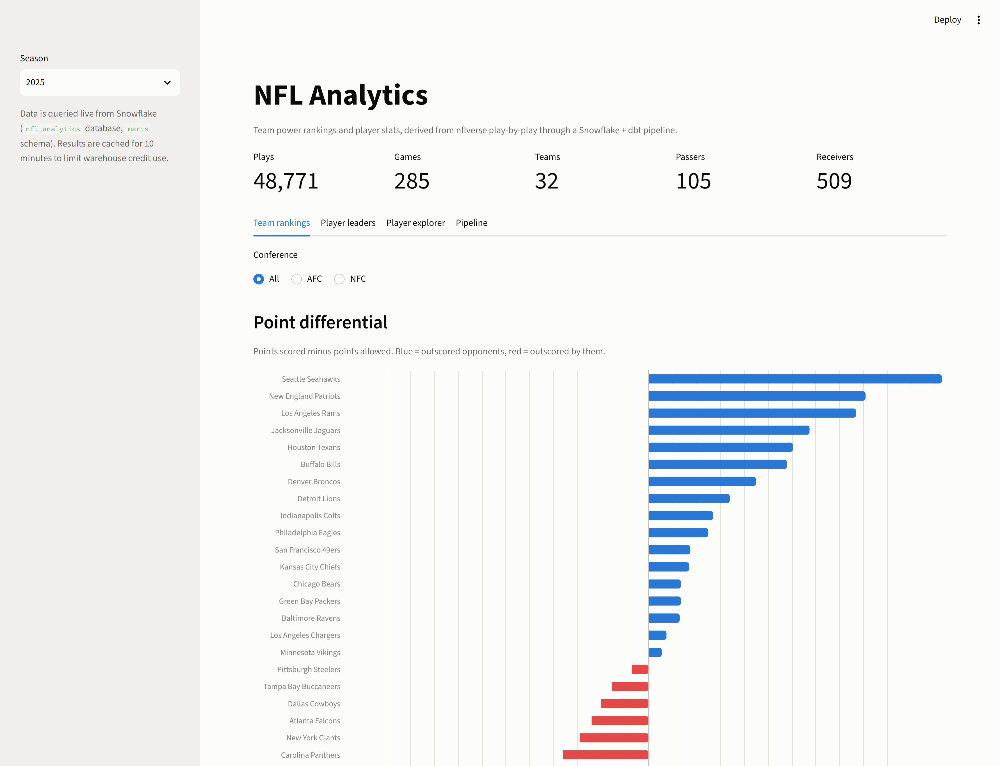
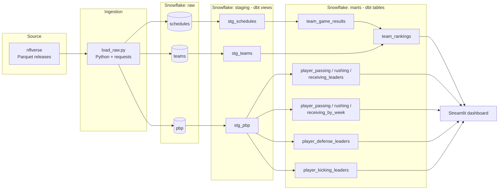
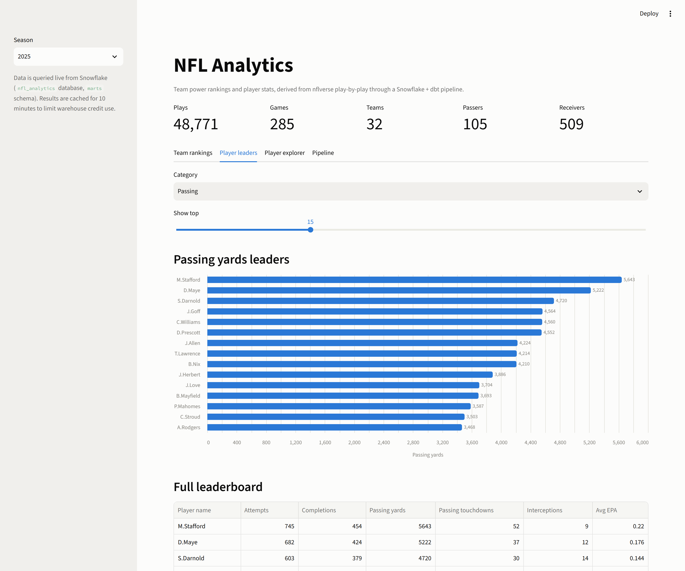
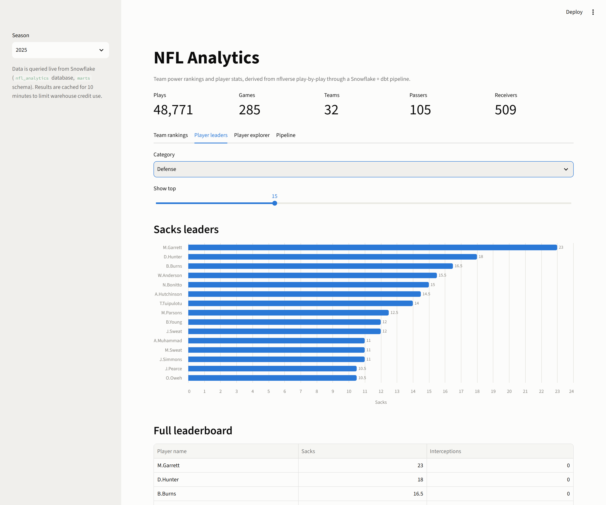
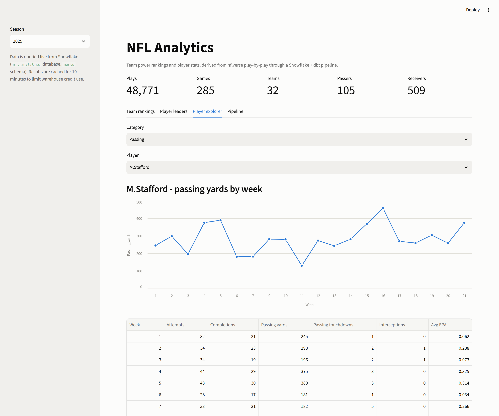
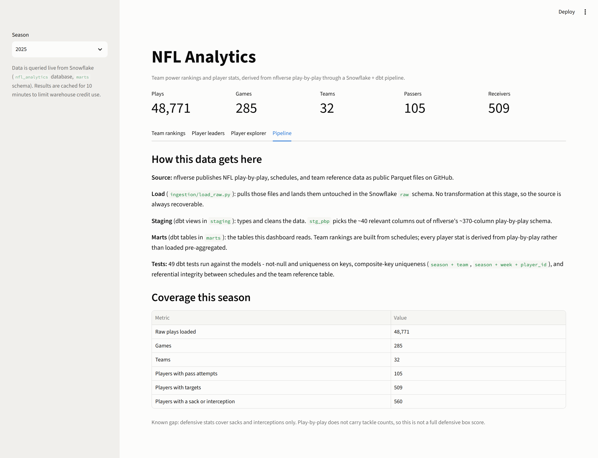

# NFL Analytics

A Snowflake + dbt warehouse that turns NFL play-by-play into team power rankings and individual player leaderboards, with a Streamlit dashboard on top and 49 dbt tests behind it.

**Snowflake · dbt · SQL · Python · Streamlit**



[Two-minute demo walkthrough](docs/portfolio/demo-walkthrough.md) · [Resume and portfolio copy](docs/portfolio/resume-entry.md)

Second data engineering project, built to learn warehouse modeling and dbt as a complement to [golf-de-pipeline](https://github.com/chrisrichnow/golf-de-pipeline) (Postgres/Airflow ELT). Snowflake + dbt was chosen deliberately over Databricks/Spark after weighing the fit: NFL season stats run in the hundreds of thousands of rows, fully structured, batch-updated weekly - that's a warehouse-shaped problem, not a big-data one. Databricks/PySpark is queued for a future project where the data actually forces distributed processing (e.g. NYC taxi trips or NFL Next Gen Stats player-tracking data).

## The problem

nflverse publishes NFL play-by-play as one wide, messy table: ~370 columns, one row per play, with stats scattered across role-specific columns (`passer_player_id`, `sack_player_id`, `half_sack_1_player_id`, and so on). Nothing in it is a leaderboard. Turning that into "who leads the league in sacks" means correctly attributing every play to the right player, applying the NFL's half-sack convention, and handling a source feed that spells the same player's name two different ways mid-season. Doing that in a way that stays correct as new games land every week is the actual engineering problem.

## What is working

Verified September 9, 2026, validated against the completed 2025 season (the 2026 season starts tonight; nflverse typically publishes each season's file a day or so after week 1 - rerun ingestion with `NFL_SEASON=2026` once it's live):

| Dataset | Count |
|---|---:|
| Raw play-by-play rows loaded | 48,771 |
| Completed games loaded | 285 |
| dbt models (staging + marts) | 13 |
| dbt tests passing | 49 / 49 |

Sample output from `team_rankings` (2025 season, top 5 by power rank):

| Rank | Team | W-L | Win % | Point Diff |
|---:|---|---|---:|---:|
| 1 | Seattle Seahawks | 17-3 | .850 | +246 |
| 2 | New England Patriots | 17-4 | .810 | +182 |
| 3 | Denver Broncos | 15-4 | .789 | +90 |
| 4 | Los Angeles Rams | 14-6 | .700 | +174 |
| 5 | Jacksonville Jaguars | 13-5 | .722 | +135 |

Sample output from `player_passing_leaders` (2025 season, top passer): M. Stafford - 745 attempts, 454 completions, 5,643 yards, 52 TD.

## Why Snowflake + dbt (not Databricks/Spark)

| Decision factor | NFL season stats | Verdict |
|---|---|---|
| Volume | ~45-50K plays/season, low hundreds of thousands of rows total | Warehouse-scale, not Spark-scale |
| Shape | Structured, clean Parquet with defined schema (nflverse) | SQL-native |
| Transform complexity | Rankings, rolling averages, leaderboards | Standard SQL window functions |
| Update pattern | Weekly batch during season | No streaming need |
| Cost/ops | Spark cluster overhead buys nothing at this volume | Warehouse is cheaper and faster to iterate on |

## Data source

[nflverse](https://github.com/nflverse/nflverse-data) public GitHub release Parquet files - play-by-play, schedules, and team reference data. Free, no API key. `nfl_data_py` (the usual Python wrapper) was tried first but dropped: it pins `pandas<2.0`, which has no working install on modern Python, so the ingestion script fetches the same underlying Parquet files directly with `requests` + `pandas.read_parquet` instead.

Player-game stats are **not** loaded pre-aggregated - nflverse's combined `player_stats.parquet` file only covers seasons through 2024, so it's useless for the current season anyway. Instead they're derived downstream in dbt directly from play-by-play, which is the more defensible approach: build your own aggregations from raw source data rather than depend on someone else's pre-computed table.

## Architecture



Season totals and per-game splits are built from the same `stg_pbp` view at different grains, so a player's weekly rows and season row can never disagree - they are the same aggregation with `week` added to the group-by.

- **Load** (`ingestion/load_raw.py`): fetches PBP, schedules, and team reference Parquet files from nflverse's GitHub releases and loads them as-is into Snowflake raw tables via `write_pandas`. No transformation - this is the bronze/raw layer, preserved exactly as published. Handles a 404 gracefully (current season not yet published) instead of crashing.
- **Staging** (`dbt_project/models/staging/`): typed, cleaned views. `stg_pbp` selects and casts the ~30 relevant columns out of nflverse's ~370-column play-by-play schema; `stg_schedules` filters to completed games only; `stg_teams` is reference data passthrough.
- **Marts** (`dbt_project/models/marts/`): `team_game_results` unpivots schedules into one row per team per game; `team_rankings` aggregates that into win%, point differential, and a season power rank. Player stats cover offense (`player_passing_leaders` / `player_rushing_leaders` / `player_receiving_leaders` - season totals; `player_passing_by_week` / `player_rushing_by_week` / `player_receiving_by_week` - per-game splits), defense (`player_defense_leaders` - sacks with correct half-sack credit, plus interceptions; play-by-play has no tackle counts so this isn't a full box score), and kicking (`player_kicking_leaders` - FG/XP makes, attempts, and %).

Snowflake database `nfl_analytics`, schemas `raw` / `staging` / `marts`.

- **Tests** (`dbt_project/models/*/‌_*.yml`): 49 dbt tests - not-null and uniqueness on keys, composite-key uniqueness via `dbt_utils.unique_combination_of_columns` (e.g. `season + team`, `game_id + play_id`, `season + week + player_id`), and referential integrity between schedules and the team reference table.

### Known data-quality bug found and fixed

dbt tests caught a real duplicate: nflverse's raw feed has inconsistent name abbreviations for the same `player_id` mid-season (e.g. `M.Wilson` vs `Mi.Wilson` once a second Wilson became active), which was splitting player-leaderboard rows in two. Fixed by grouping on `player_id` alone and picking the most common name variant with `MODE()` instead of grouping on the (inconsistent) name column directly.

### Two Snowflake-specific quirks hit along the way

- Snowflake can't cast a float/number directly to `BOOLEAN` - `0::boolean` fails; needs `0::number::boolean`.
- Snowflake sorts `NULL` **first** in `ORDER BY ... DESC` by default (opposite of Postgres). A leaderboard `rank()` without null-safe yardage sums put null-stat trick-play rows at rank #1 above real quarterbacks until yardage columns were coalesced to 0 upstream in `stg_pbp`.

## Quick start - Windows / PowerShell

Prerequisites: Python 3.12 (3.14 has no working wheels yet for pandas/numpy - a dedicated `.venv` here uses 3.12 even if your system default is newer), and a Snowflake account.

```powershell
py -3.12 -m venv .venv
.\.venv\Scripts\python.exe -m pip install -r requirements.txt
Copy-Item .env.example .env
```

Fill in your own Snowflake account, user, and password in `.env`. Then create the warehouse, database, and schemas by running `docs/snowflake_setup.sql` once in a Snowsight worksheet.

Load raw data (defaults to the current year; override with `NFL_SEASON`):

```powershell
$env:NFL_SEASON = "2026"
.\.venv\Scripts\python.exe ingestion\load_raw.py
```

Build and test the dbt models. Use `run_dbt.py` rather than calling `dbt` directly with a shell-sourced `.env` - PowerShell/bash can mangle special characters in the password; this script loads `.env` straight into the subprocess environment instead:

```powershell
.\.venv\Scripts\python.exe run_dbt.py run
.\.venv\Scripts\python.exe run_dbt.py test
```

Launch the dashboard, then open **http://localhost:8501**:

```powershell
.\.venv\Scripts\python.exe -m streamlit run dashboard\app.py
```

## Dashboard

A Streamlit app (`dashboard/`) that reads the marts live from Snowflake. Four views:

**Team rankings** - point differential as a diverging bar chart (blue outscored opponents, red got outscored), plus full standings with an AFC/NFC filter. See the screenshot at the top of this README.

**Player leaders** - season leaderboards for passing, rushing, receiving, defense, and kicking, with an adjustable top-N.



The same view switched to defense. Sacks use the NFL's half-sack convention, so split sacks show as `.5` - `player_defense_leaders` credits 1.0 for a solo sack and 0.5 to each player on a shared one.



**Player explorer** - week-by-week performance for any individual player. Bye weeks correctly appear as gaps rather than zeros, because the underlying weekly mart has no row for a week the player did not play.



**Pipeline** - a plain-English walkthrough of how the data gets from nflverse to these tables, plus live coverage counts and an explicit statement of the known defensive-stats gap.



Query results are cached for 10 minutes (`@st.cache_data`) and the connection is held open (`@st.cache_resource`) so interacting with filters does not repeatedly wake the warehouse - the trial account is credit-metered and `nfl_wh` auto-suspends after 60 seconds idle.

## Scope and limitations

- Snowflake free trial account (30-day / credit-based) - this is a learning project, not a production deployment.
- No live odds/betting integration; stats and rankings only, separate from the sports-trading-bot project.
- Historical multi-season backfill is a stretch goal after the current-season pipeline is validated on live 2026 data.
- No orchestration (Airflow/dbt Cloud scheduling) yet - reruns are manual. A stretch goal once the season is underway.

## Repository map

```text
ingestion/
  load_raw.py       Pulls nflverse Parquet, loads to raw Snowflake tables
dbt_project/
  models/staging/   stg_pbp, stg_schedules, stg_teams + tests
  models/marts/     team_game_results, team_rankings, player_*_leaders, player_*_by_week, player_defense_leaders, player_kicking_leaders + tests
  macros/           generate_schema_name override (clean schema names)
  packages.yml      dbt_utils (composite-key uniqueness tests)
dashboard/
  app.py            Streamlit UI - rankings, leaderboards, player explorer, pipeline
  queries.py        Cached read-only Snowflake access
run_dbt.py          Wrapper that runs dbt with .env loaded safely
requirements.txt
.env.example
```

Progress tracked in `PROGRESSION.md`.
